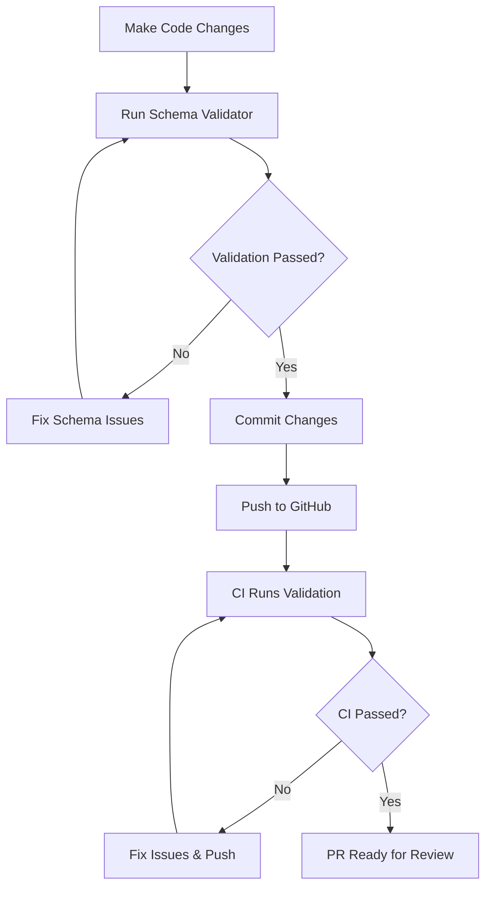

# SIEM Platform

A comprehensive Security Information and Event Management (SIEM) platform built with Rust, ClickHouse, and React TypeScript.

## 🔒 Schema Governance & Validation

**CRITICAL**: This project enforces strict schema validation to maintain database consistency across all components.

### 🚨 Before Contributing

**ALL contributors must follow schema validation rules:**

```bash
# 1. Run schema validator before any commit
cargo run --bin schema_validator_v2

# 2. Set up automatic pre-commit validation
./scripts/setup-pre-commit-hook.sh

# 3. Ensure validation passes (0 critical issues)
```

### 📋 Schema Validation Rules

| Rule | Description | Enforcement |
|------|-------------|-------------|
| **No Missing Columns** | All SQL queries must reference existing columns in `database_setup.sql` | ❌ Blocks CI |
| **No Missing Tables** | All table references must exist in database schema | ❌ Blocks CI |
| **No Hardcoded DB Names** | Use environment variables instead of `dev.` prefixes | ⚠️ Warning |
| **Schema Consistency** | Rust structs ↔ Database columns ↔ TypeScript interfaces must match | ❌ Blocks CI |

### 🔄 Development Workflow



## 🚀 Deployment Mode

**This SIEM system runs in Docker-free mode** with all services as native processes.

📖 **See [DEPLOYMENT_MODE.md](./DEPLOYMENT_MODE.md) for complete deployment architecture details**

- ✅ All services compiled as native binaries
- ✅ No Docker/containers required
- ✅ Direct process management
- ✅ Optimal performance and resource usage

## 🏗️ Architecture

### Core Components

- **SIEM API** (`siem_api/`) - REST API server (Rust + Axum)
- **SIEM Consumer** (`siem_consumer/`) - Event processing pipeline (Rust + Kafka)
- **SIEM UI** (`siem_ui/`) - Web interface (React + TypeScript + Vite)
- **SIEM Parser** (`siem_parser/`) - Log parsing engine (Rust)
- **SIEM Agent** (`siem_agent/`) - Data collection agent (Rust)

### Database

- **ClickHouse** - Primary analytics database
- **Schema Definition** - `database_setup.sql`
- **Validation** - `schema_validator_v2.rs`

## 🚀 Quick Start

### Prerequisites

- Rust 1.70+
- Node.js 18+
- ClickHouse 23+

### Setup

1. **Clone and setup validation**:
   ```bash
   git clone <repository>
   cd sim6
   ./scripts/setup-pre-commit-hook.sh
   ```

2. **Install dependencies**:
   ```bash
   # Rust dependencies
   cargo build
   
   # UI dependencies
   cd siem_ui && npm install
   ```

3. **Setup database**:
   ```bash
   # Apply schema
   clickhouse-client < database_setup.sql
   ```

4. **Validate schema**:
   ```bash
   cargo run --bin schema_validator_v2
   ```

5. **Start services**:
   ```bash
   # API Server
   cd siem_api && cargo run
   
   # Consumer
   cd siem_consumer && cargo run
   
   # UI Development Server
   cd siem_ui && npm run dev
   ```

## 🧪 Testing

### Schema Validation Testing

```bash
# Run full schema validation
cargo run --bin schema_validator_v2

# Check specific components
cargo test schema_validation

# Validate before commit (automatic with pre-commit hook)
git commit -m "your changes"
```

### Component Testing

```bash
# API tests
cd siem_api && cargo test

# UI tests
cd siem_ui && npm test

# Integration tests
./scripts/run_integration_tests.sh
```

## 📊 Monitoring & Validation Reports

### Schema Validation Reports

- **Human-readable**: `schema_validation_report.md`
- **Machine-readable**: `schema_validation_report.json`
- **CI Artifacts**: Available in GitHub Actions

### Validation Metrics

- **Critical Issues**: Must be 0 for CI to pass
- **Warnings**: Acceptable but should be addressed
- **Coverage**: SQL references vs. schema definitions

## 🔧 Configuration

### Environment Variables

```bash
# Database
DATABASE_URL=clickhouse://localhost:9000/dev
DATABASE_NAME=dev

# API
API_PORT=8080
JWT_SECRET=your-secret-key

# Consumer
KAFKA_BROKERS=localhost:9092
```

### Schema Configuration

- **Schema File**: `database_setup.sql`
- **Validator Config**: Built into `schema_validator_v2.rs`
- **CI Validation**: `.github/workflows/schema-validation.yml`

## 🤝 Contributing

**READ THIS FIRST**: [CONTRIBUTING.md](CONTRIBUTING.md)

### Schema Change Process

1. **Update Schema**: Modify `database_setup.sql`
2. **Update Code**: Ensure Rust structs match database columns
3. **Update UI**: Ensure TypeScript interfaces match backend JSON
4. **Validate**: Run `cargo run --bin schema_validator_v2`
5. **Test**: Verify end-to-end functionality
6. **Submit PR**: Include validation report summary

### Code Review Requirements

- ✅ Schema validation must pass
- ✅ All tests must pass
- ✅ No hardcoded database names
- ✅ Consistent naming across layers
- ✅ Documentation updated if needed

## 🚨 Troubleshooting

### Common Schema Issues

| Error | Cause | Solution |
|-------|-------|----------|
| `MissingColumn` | SQL references non-existent column | Check `database_setup.sql` for correct column name |
| `MissingTable` | SQL references undefined table | Add table definition or fix table name |
| `HardcodedDatabaseName` | Uses `dev.` prefix | Use environment variable |

### Validation Failures

```bash
# Check detailed issues
cat schema_validation_report.md

# Fix and re-validate
cargo run --bin schema_validator_v2

# Force commit (not recommended)
git commit --no-verify -m "bypass validation"
```

## 📚 Documentation

- **API Documentation**: `siem_api/docs/`
- **Schema Reference**: `database_setup.sql`
- **Contributing Guide**: `CONTRIBUTING.md`
- **Validation Reports**: Generated after each validation run

## 🔐 Security

- **Schema Validation**: Prevents SQL injection through schema consistency
- **Type Safety**: Rust + TypeScript ensure compile-time safety
- **Access Control**: Role-based authentication and authorization
- **Audit Logging**: All schema changes are tracked

## 📈 Performance

- **ClickHouse**: Optimized for analytics workloads
- **Rust**: Zero-cost abstractions and memory safety
- **React**: Modern UI with efficient rendering
- **Validation**: Fast schema checking with detailed reporting

## 🎯 Roadmap

- [ ] **Auto-generation**: Generate Rust structs and TS interfaces from schema
- [ ] **Advanced Validation**: Cross-table relationship validation
- [ ] **Performance Metrics**: Schema validation performance tracking
- [ ] **IDE Integration**: Real-time schema validation in editors

---

**Remember**: Schema consistency is critical for production stability. Always validate before committing! 🛡️

For questions or issues, check the validation reports or reach out to the team.