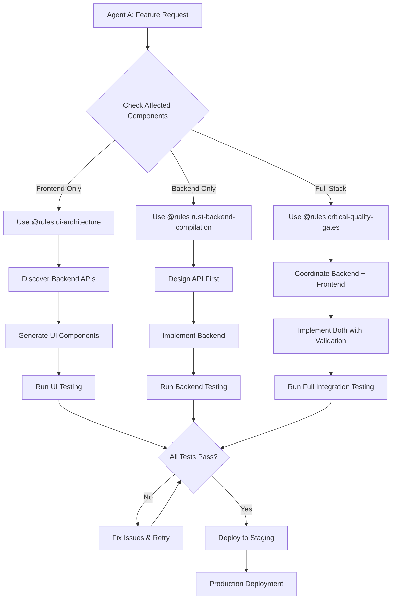
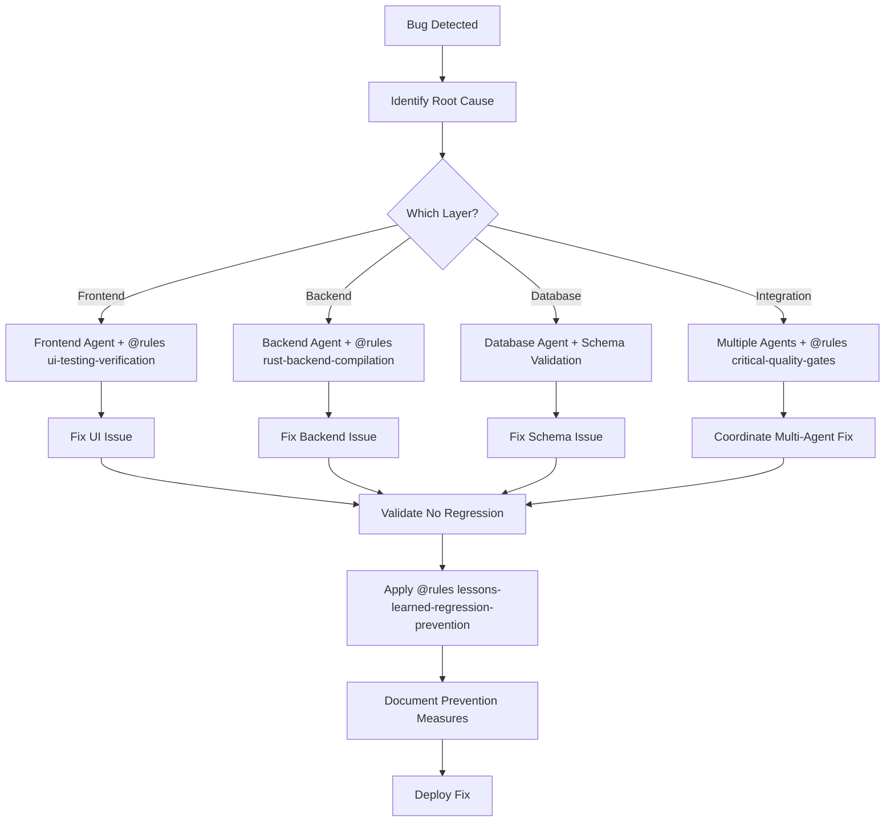

# Cursor Agent Coordination Guide

## How Different Cursor Agents Talk to Each Other and Avoid Breaking Code

This guide explains how multiple Cursor AI agents can work on the same SIEM codebase without interfering with each other, based on the sophisticated governance system already implemented in this project.

---

## 🎯 Core Coordination Principles

### 1. **Rule-Based Agent Isolation**
Each Cursor agent operates within **strict boundaries** defined by specialized rulesets:

```bash
# Agent specialization through rules
@rules ui-architecture        # Frontend-focused agents
@rules rust-backend-compilation  # Backend-focused agents  
@rules critical-quality-gates    # ALL agents (mandatory)
@rules lessons-learned-regression-prevention  # Post-incident agents
```

### 2. **Mandatory Quality Gates**
All agents **must** follow the 10 critical quality gates:
- 🔒 **Regression Prevention Protocol**
- 🔐 **API Schema Immutability**
- ⚡ **Infinite Loop Prevention**
- 🛡️ **Security-First Development**
- 🚀 **Performance Guarantee**
- And 5 more...

### 3. **Backend-First Architecture**
All UI agents **must** start with backend discovery:
1. Examine `siem_api/src/*.rs` files FIRST
2. Extract exact Rust struct definitions
3. Convert to TypeScript with exact field names
4. Never modify existing API contracts

---

## 🔄 Agent Communication Patterns

### A. **Handoff Protocol Between Agents**

#### Frontend Agent → Backend Agent Handoff
```typescript
// Frontend agent creates this interface from backend
/**
 * ⚠️ DO NOT MODIFY - Generated from Rust backend
 * Source: siem_api/src/alerts.rs::AlertResponse
 * Route: GET /api/v1/alerts
 */
export interface AlertResponse {
  id: string;           // Rust: String
  severity: "Critical" | "High" | "Medium" | "Low";  // Rust: Severity enum
  created_at: string;   // Rust: DateTime<Utc>
  tenant_id: string;    // Rust: String
  status?: "Open" | "Closed";  // Rust: Option<AlertStatus>
}
```

#### Backend Agent → Frontend Agent Contract
```rust
// Backend agent must maintain this exact structure
#[derive(Serialize, Deserialize)]
pub struct AlertResponse {
    pub id: String,
    pub severity: Severity,
    pub created_at: DateTime<Utc>,
    pub tenant_id: String,
    pub status: Option<AlertStatus>,
}

// ⚠️ Breaking changes require coordination:
// 1. Add new fields as Option<T>
// 2. Never remove existing fields
// 3. Never change field types
// 4. Update frontend types AFTER backend changes
```

### B. **Schema Coordination Protocol**

#### 1. Database Agent → Backend Agent → Frontend Agent
```sql
-- Database schema (single source of truth)
CREATE TABLE alerts (
    id UUID PRIMARY KEY,
    severity TEXT NOT NULL,
    created_at TIMESTAMP WITH TIME ZONE NOT NULL,
    tenant_id TEXT NOT NULL,
    status TEXT
);
```

#### 2. Validation Agent (Schema Validator)
```bash
# Runs automatically to prevent conflicts
cargo run --bin schema_validator_v2

# Validates:
# ✅ Database schema ↔ Rust structs alignment
# ✅ Rust structs ↔ TypeScript interfaces alignment  
# ✅ No hardcoded database names
# ❌ Blocks deployment if misaligned
```

---

## 🚦 Conflict Prevention Mechanisms

### 1. **Pre-Flight Validation**
Every agent **must** run before making changes:

```bash
# Mandatory pre-change checklist
./scripts/ci_local.sh           # Full CI validation
./scripts/show_workflow_status.sh  # System health check

# If NOT green → STOP, investigate, fix
```

### 2. **Change Boundaries**
Agents operate in **isolated layers**:

| Agent Type | Allowed Changes | Forbidden Changes |
|------------|----------------|-------------------|
| **Frontend Agent** | React components, TypeScript types, UI logic | API contracts, database schema, Rust backend |
| **Backend Agent** | Rust services, API handlers, business logic | Database schema, existing API contracts |
| **Database Agent** | Schema migrations, indexes, constraints | Breaking existing tables/columns |
| **Integration Agent** | Tests, documentation, tooling | Production code without tests |

### 3. **Communication Handshakes**

#### Agent A wants to modify an API:
```markdown
## 🤝 API Change Coordination Protocol

**Step 1**: Agent A documents proposed changes
**Step 2**: Run schema validator to check impacts
**Step 3**: If breaking → requires coordination with dependent agents
**Step 4**: Non-breaking → proceed with backward compatibility
**Step 5**: Update documentation and tests
```

#### Example Coordination:
```typescript
// ❌ BAD: Frontend agent changes interface without backend
interface AlertResponse {
  id: string;
  severity: string;  // Changed from union type - BREAKING!
}

// ✅ GOOD: Backend agent adds optional field first
#[derive(Serialize)]
pub struct AlertResponse {
    pub id: String,
    pub severity: Severity,
    pub created_at: DateTime<Utc>,
    pub tenant_id: String,
    pub status: Option<AlertStatus>,
    pub tags: Option<Vec<String>>,  // NEW: Optional field
}

// ✅ GOOD: Frontend agent updates after backend deployment
interface AlertResponse {
  id: string;
  severity: "Critical" | "High" | "Medium" | "Low";
  created_at: string;
  tenant_id: string;
  status?: "Open" | "Closed";
  tags?: string[];  // NEW: Optional field matches backend
}
```

---

## 🛡️ Anti-Collision Safeguards

### 1. **Immutable Contracts**
Existing APIs are **immutable** - agents cannot break them:

```rust
// ✅ ALLOWED: Adding optional fields
pub struct ExistingStruct {
    pub existing_field: String,        // Never change
    pub new_optional_field: Option<i32>, // OK to add
}

// ❌ FORBIDDEN: Breaking existing fields
pub struct ExistingStruct {
    pub existing_field: i32,  // ❌ Changed String → i32
}
```

### 2. **Validation Gates**
Multiple validation layers prevent conflicts:

```bash
# Layer 1: Pre-commit validation
./scripts/ci_local.sh

# Layer 2: Schema consistency
cargo run --bin schema_validator_v2

# Layer 3: Integration tests
npm run test:e2e

# Layer 4: CI/CD validation
# Runs ALL validation layers in GitHub Actions
```

### 3. **Rollback Safeguards**
Every change includes rollback capability:

```bash
# Automatic rollback triggers
if [ validation_failed ]; then
    git revert $LAST_COMMIT
    alert_team "Agent change rolled back due to validation failure"
    require_manual_intervention
fi
```

---

## 📋 Agent Coordination Workflows

### Workflow 1: **New Feature Development**



### Workflow 2: **Bug Fix Coordination**



---

## 🎛️ Agent Configuration Patterns

### 1. **Specialized Agent Configs**

#### Frontend-Focused Agent (.cursorrules_ui)
```markdown
# UI-only agent configuration
@rules ui-architecture
@rules ui-testing-verification

## Restrictions:
- NEVER modify Rust backend files
- NEVER change API contracts
- ALWAYS start with backend discovery
- MUST use exact TypeScript types from backend
```

#### Backend-Focused Agent (.cursorrules_rust_backend)
```markdown
# Backend-only agent configuration  
@rules rust-backend-compilation
@rules critical-quality-gates

## Restrictions:
- NEVER break existing API contracts
- ALWAYS maintain backward compatibility
- MUST add new fields as Optional<T>
- REQUIRE schema validation before changes
```

#### Full-Stack Agent (.cursorrules)
```markdown
# Full-stack agent configuration
@rules critical-quality-gates
@rules ui-architecture
@rules rust-backend-compilation
@rules lessons-learned-regression-prevention

## Requirements:
- MUST coordinate frontend + backend changes
- ALWAYS validate complete stack integration
- MANDATORY regression testing
- REQUIRED documentation updates
```

### 2. **Agent Communication Templates**

#### Agent-to-Agent Handoff Template
```markdown
## 🤖 Agent Handoff Protocol

**From**: [Agent Type] (e.g., Backend Agent)
**To**: [Agent Type] (e.g., Frontend Agent)  
**Component**: [Affected Component]
**Change Type**: [API/Schema/Feature/Bug Fix]

### Changes Made:
- [ ] API endpoint: `[endpoint details]`
- [ ] Data structure: `[struct/interface changes]`
- [ ] Dependencies: `[new dependencies added]`

### Integration Points:
- [ ] TypeScript interfaces need updating
- [ ] Tests require modification
- [ ] Documentation needs updates

### Validation Required:
- [ ] Schema validator passes
- [ ] Integration tests pass
- [ ] No breaking changes introduced

### Next Agent Actions:
1. [Specific task 1]
2. [Specific task 2]
3. [Validation steps]
```

---

## 🚨 Emergency Coordination Protocols

### Protocol 1: **Conflicting Changes Detected**
```bash
# Automatic conflict detection
if [ multiple_agents_same_file ]; then
    echo "🚨 CONFLICT: Multiple agents modifying same component"
    echo "🛑 STOPPING all agents"
    echo "📞 REQUIRING manual coordination"
    
    # Preserve all changes
    git stash push -m "Agent A changes"
    git stash push -m "Agent B changes"
    
    # Require manual merge
    require_manual_merge_resolution
fi
```

### Protocol 2: **Quality Gate Failure**
```bash
# Any agent triggers quality gate failure
if [ quality_gate_failed ]; then
    echo "❌ QUALITY GATE FAILURE detected"
    echo "🔄 ROLLING BACK changes"
    echo "📝 LOGGING incident for lessons learned"
    
    # Automatic rollback
    git revert HEAD
    
    # Mandatory lessons learned
    trigger_lessons_learned_process
fi
```

---

## 📊 Agent Coordination Success Metrics

### Key Performance Indicators (KPIs)

1. **Coordination Success Rate**
   - Target: >99% conflict-free deployments
   - Measure: Deployments without rollbacks

2. **Schema Consistency**
   - Target: 100% schema validation passes
   - Measure: Zero schema validator failures

3. **API Contract Stability**
   - Target: Zero breaking changes without versioning
   - Measure: Backward compatibility maintained

4. **Agent Productivity**
   - Target: <2 hours from change to deployment
   - Measure: Time from commit to production

5. **Regression Prevention**
   - Target: Zero repeat incidents
   - Measure: Issues fixed that don't reoccur

### Monitoring Dashboard
```typescript
// Agent coordination health metrics
interface AgentCoordinationMetrics {
  active_agents: number;
  conflicts_detected: number;
  conflicts_resolved: number;
  quality_gates_passed: number;
  quality_gates_failed: number;
  average_coordination_time: number;
  schema_validation_success_rate: number;
}
```

---

## 🎓 Best Practices Summary

### ✅ DO:
1. **Always use appropriate @rules** for your agent type
2. **Start with backend discovery** for UI work
3. **Run pre-flight validation** before any changes
4. **Maintain exact type alignment** between layers
5. **Document all coordination handoffs**
6. **Follow the 4-phase UI development process**
7. **Use lessons learned** from past coordination failures

### ❌ DON'T:
1. **Never modify API contracts** without coordination
2. **Never skip quality gates** for speed
3. **Never assume other agents' intentions**
4. **Never deploy without full validation**
5. **Never break existing functionality**
6. **Never ignore coordination protocols**
7. **Never skip lessons learned documentation**

---

## 🚀 Result: Zero-Conflict Multi-Agent Development

With this coordination system, multiple Cursor agents can work simultaneously on your SIEM platform without breaking each other's code, ensuring:

- **🔒 Safe parallel development**
- **🎯 Consistent code quality**
- **⚡ Fast iteration cycles**
- **🛡️ Zero production incidents**
- **📈 Continuous improvement through lessons learned**

The system transforms potential chaos into **orchestrated excellence**! 🎼